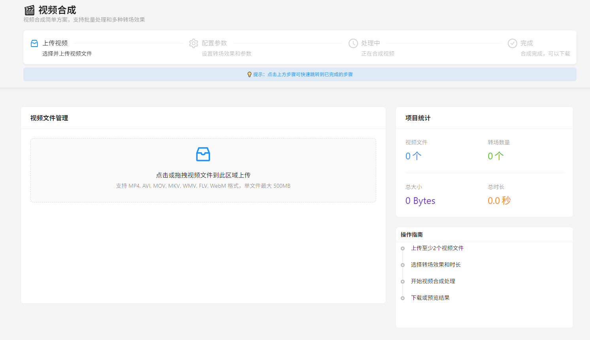
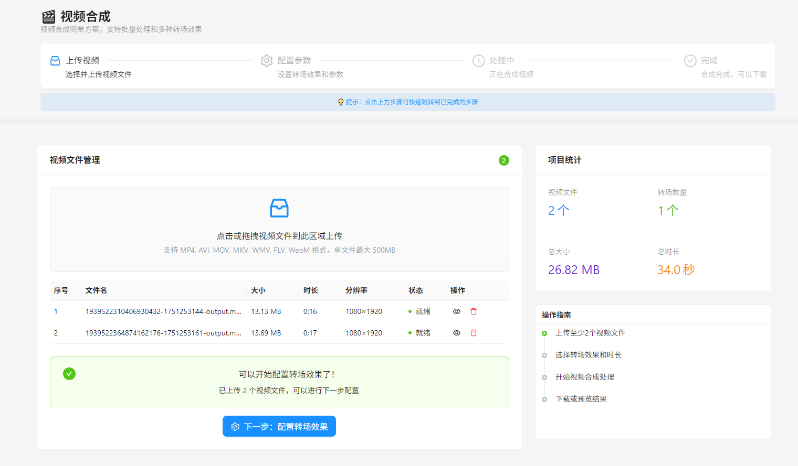
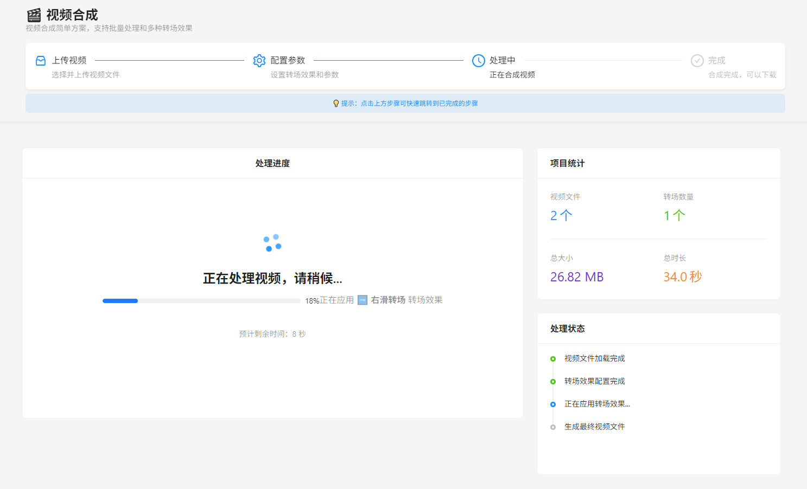
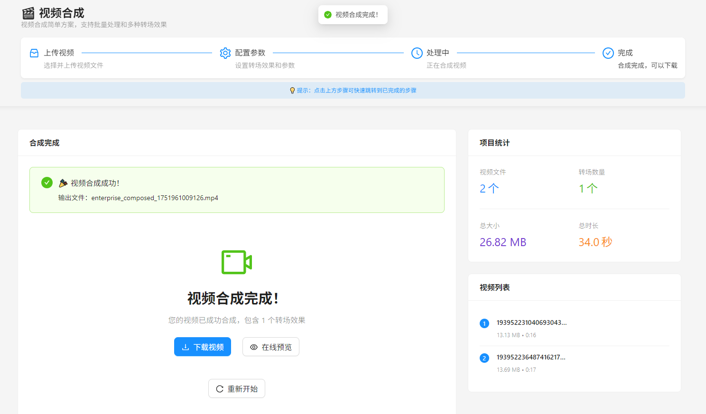

# 🎬 视频合成系统

<div align="center">


一个基于 **Python Flask** 和 **React** 的现代化视频合成系统，支持多种专业转场效果的简单解决方案。

[功能特性](#-功能特性) • [快速开始](#-快速开始快速开始) • [API文档](#-api-接口api-接口) 

</div>

---

## ✨ 功能特性

### 🎯 核心功能
- 🎬 **多视频合成** - 支持批量上传和合成多个视频文件
- ✨ **丰富转场效果** - 7种专业转场效果（淡入淡出、滑动、缩放等）
- 📱 **现代化界面** - 基于Ant Design的企业级UI设计
- ⚡ **高性能处理** - 异步任务处理，支持大文件处理
- 📊 **实时反馈** - 处理进度实时显示和状态更新
- 💾 **便捷操作** - 在线预览、一键下载合成结果

### 🛠️ 技术亮点
- **前后端分离** - RESTful API设计，前后端完全解耦
- **模块化日志** - 按功能模块组织的清晰日志系统
- **错误处理** - 完善的异常处理和用户友好的错误提示
- **响应式设计** - 支持桌面端和移动端访问
- **文件管理** - 智能文件管理和存储优化

## 📁 项目结构

```
Video_synthesis/
├── 📂 backend/                        # 后端服务
│   ├── 🐍 app.py                     # Flask 主应用
│   ├── 🎬 advanced_video_processor.py # 高级视频处理器
│   ├── 📋 logger_config.py           # 日志配置模块
│   ├── 📦 requirements.txt           # Python 依赖
│   ├── 🧪 test_transitions.py        # 转场效果测试
│   ├── 🧪 test_video_processor.py    # 视频处理器测试
│   ├── 📁 uploads/                   # 上传文件目录
│   └── 📁 outputs/                   # 输出文件目录
├── 📂 frontend/                       # 前端应用
│   ├── 📂 src/
│   │   ├── 📂 components/
│   │   │   └── 🎯 EnterpriseVideoComposer.jsx  # 视频合成组件
│   │   ├── ⚛️ App.jsx                # 主应用组件
│   │   ├── 🎨 App.css                # 应用样式
│   │   ├── 🎨 index.css              # 全局样式
│   │   └── 🚀 main.jsx               # 应用入口
│   ├── 📂 public/                    # 静态资源
│   ├── 📦 package.json               # 前端依赖
│   └── ⚙️ vite.config.js            # Vite 配置
└── 📖 README.md                      # 项目文档
```

## 🛠️ 技术栈

<table>
<tr>
<td>

### 🐍 后端技术
- **Python 3.8+** - 核心开发语言
- **Flask 2.0+** - 轻量级Web框架
- **MoviePy** - 专业视频处理库
- **FFmpeg** - 底层视频编解码
- **CORS** - 跨域资源共享

</td>
<td>

### ⚛️ 前端技术
- **React 18** - 现代化前端框架
- **Vite** - 快速构建工具
- **Ant Design** - 企业级UI组件
- **Axios** - HTTP请求库
- **CSS3** - 现代样式设计

</td>
</tr>
</table>

## 🚀 快速开始

### 📋 环境要求

- **Python 3.8+**
- **Node.js 16+**
- **FFmpeg** (用于视频处理)

### 🔧 安装步骤

#### 1️⃣ 克隆项目
```bash
git clone https://github.com/ZHlovecat/video-synthesis.git
cd video-synthesis
```

#### 2️⃣ 后端设置
```bash
cd backend

# 安装Python依赖
pip install -r requirements.txt

# 启动后端服务
python app.py
```

#### 3️⃣ 前端设置
```bash
cd frontend

# 安装Node.js依赖
npm install

# 启动开发服务器
npm run dev
```

#### 4️⃣ 访问应用
- 🌐 **前端界面**: http://localhost:5173
- 🔌 **后端API**: http://localhost:5000

## 📡 API 接口

<details>
<summary>点击展开完整API文档</summary>

### 🔍 系统接口
| 方法 | 端点 | 描述 |
|------|------|------|
| `GET` | `/api/health` | 健康检查 |
| `GET` | `/api/transitions` | 获取转场效果列表 |

### 📁 文件管理
| 方法 | 端点 | 描述 |
|------|------|------|
| `POST` | `/api/upload` | 上传视频文件 |
| `GET` | `/api/files` | 列出所有文件 |
| `GET` | `/api/preview/<filename>` | 预览视频文件 |
| `GET` | `/api/download/<filename>` | 下载视频文件 |

### 🎬 视频处理
| 方法 | 端点 | 描述 |
|------|------|------|
| `POST` | `/api/compose` | 创建视频合成任务 |

### 📝 请求示例

#### 上传文件
```bash
curl -X POST -F "files=@video1.mp4" -F "files=@video2.mp4" \
  http://localhost:5000/api/upload
```

#### 创建合成任务
```bash
curl -X POST -H "Content-Type: application/json" \
  -d '{
    "video_files": ["uploads/video1.mp4", "uploads/video2.mp4"],
    "transitions": [{"type": "fade", "duration": 1.0}],
    "output_filename": "result.mp4"
  }' \
  http://localhost:5000/api/compose
```

</details>

## 🎨 支持的转场效果

<table>
<tr>
<td align="center">🌅</td>
<td><strong>淡入淡出 (fade)</strong></td>
<td>交叉淡入淡出，最稳定优雅</td>
</tr>
<tr>
<td align="center">⬅️</td>
<td><strong>左滑转场 (slide_left)</strong></td>
<td>从右向左滑动，动感十足</td>
</tr>
<tr>
<td align="center">➡️</td>
<td><strong>右滑转场 (slide_right)</strong></td>
<td>从左向右滑动，流畅自然</td>
</tr>
<tr>
<td align="center">⬆️</td>
<td><strong>上滑转场 (slide_up)</strong></td>
<td>从下向上滑动，向上提升</td>
</tr>
<tr>
<td align="center">⬇️</td>
<td><strong>下滑转场 (slide_down)</strong></td>
<td>从上向下滑动，向下展开</td>
</tr>
<tr>
<td align="center">🔍</td>
<td><strong>放大转场 (zoom_in)</strong></td>
<td>缩放放大过渡，聚焦突出</td>
</tr>
<tr>
<td align="center">🔎</td>
<td><strong>缩小转场 (zoom_out)</strong></td>
<td>缩放缩小过渡，视野扩展</td>
</tr>
</table>

### ✨ 转场特性
- ✅ **音频平滑过渡** - 自动处理音频淡入淡出
- ✅ **可调节时长** - 支持 0.5-3.0 秒转场时间
- ✅ **智能降级** - 转场失败时自动使用简单拼接
- ✅ **高质量输出** - H.264 + AAC 编码，保证质量

---

## 📸 演示

### 🖥️ 界面预览

<div align="center">

| 主界面 | 上传界面 |
|--------|----------|
|  |  |

| 合成界面 | 结果界面 |
|----------|----------|
|  |  |

</div>

### 🎬 功能演示

1. **📁 文件上传** - 支持拖拽上传，多文件批量处理
2. **⚙️ 参数配置** - 直观的转场效果选择和参数调整
3. **🔄 实时处理** - 处理进度实时显示，状态清晰可见
4. **📥 结果下载** - 一键预览和下载合成结果

---

## 🔧 配置说明

### 环境变量
```bash
# 后端配置
FLASK_ENV=development
UPLOAD_FOLDER=uploads
OUTPUT_FOLDER=outputs
MAX_CONTENT_LENGTH=500MB

# 前端配置
VITE_API_BASE_URL=http://localhost:5000
```

### 支持的文件格式
- **输入格式**: MP4, AVI, MOV, MKV, WMV, FLV, WEBM
- **输出格式**: MP4 (H.264 + AAC)
- **最大文件大小**: 500MB
- **推荐分辨率**: 1920x1080 (1080p)

---

## 🐛 故障排除

<details>
<summary>常见问题解决方案</summary>

### Q: FFmpeg 未找到
**A:** 请确保已安装 FFmpeg 并添加到系统 PATH
```bash
# Windows
choco install ffmpeg

# macOS
brew install ffmpeg

# Ubuntu
sudo apt install ffmpeg
```

### Q: 上传文件失败
**A:** 检查文件大小和格式是否符合要求
- 文件大小不超过 500MB
- 文件格式为支持的视频格式

### Q: 合成失败
**A:** 查看后端日志，常见原因：
- 视频编码格式不兼容
- 音频轨道缺失
- 磁盘空间不足

</details>

---

## 🤝 贡献

我们欢迎所有形式的贡献！

### 🔄 贡献流程
1. **Fork** 本项目
2. **创建** 功能分支 (`git checkout -b feature/AmazingFeature`)
3. **提交** 更改 (`git commit -m 'Add some AmazingFeature'`)
4. **推送** 到分支 (`git push origin feature/AmazingFeature`)
5. **创建** Pull Request

### 📝 开发规范
- 遵循 [PEP 8](https://www.python.org/dev/peps/pep-0008/) Python 代码规范
- 使用 [ESLint](https://eslint.org/) 进行 JavaScript 代码检查
- 编写清晰的提交信息
- 添加必要的测试用例

---

## 📄 许可证

本项目采用 MIT 许可证 - 查看 [LICENSE](LICENSE) 文件了解详情。

---

## 👥 作者

- **开发者** - [ZHlovecat](https://github.com/ZHlovecat)

---

## 🙏 致谢

- [MoviePy](https://zulko.github.io/moviepy/) - 强大的视频处理库
- [React](https://reactjs.org/) - 优秀的前端框架
- [Ant Design](https://ant.design/) - 企业级UI设计语言
- [Flask](https://flask.palletsprojects.com/) - 轻量级Web框架

---

<div align="center">

**⭐ 如果这个项目对您有帮助，请给它一个星标！**

</div>
